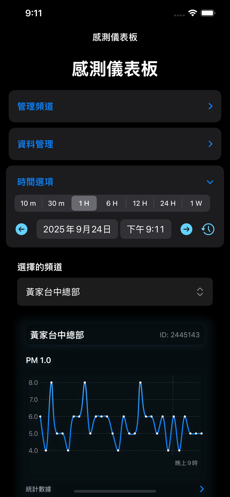
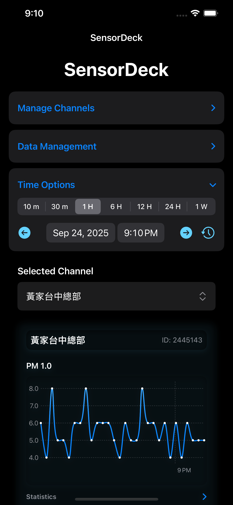

# SensorDeck: 隨時隨地監控您的 ThingSpeak 數據

# SensorDeck: Monitor Your ThingSpeak Data Anywhere, Anytime

### 將您的物聯網數據放入口袋。SensorDeck 是您在 iPhone 和 iPad 上查看 ThingSpeak 頻道的最佳夥伴。

### Put your IoT data in your pocket. SensorDeck is your best companion for viewing ThingSpeak channels on your iPhone and iPad.

SensorDeck 讓監控來自 Arduino、ESP8266/ESP32 或樹莓派 (Raspberry Pi) 的感測器數據變得前所未有的簡單。透過簡潔的儀表板，您可以即時掌握所有重要的物聯網專案數據。

SensorDeck makes monitoring sensor data from your Arduino, ESP8266/ESP32, or Raspberry Pi easier than ever. With a clean dashboard, you can instantly grasp all the important data from your IoT projects.

-----

## 核心功能

## Core Features

  * **直觀的儀表板**: 一目了然地查看您所有 ThingSpeak 頻道的最新數據。

  * **Intuitive Dashboard**: View the latest data from all your ThingSpeak channels at a glance.

  * **互動式圖表**: 縮放、平移並檢視特定時間點的數據。我們為每個數據欄位提供清晰的視覺化圖表。

  * **Interactive Charts**: Zoom, pan, and inspect data at specific points in time. We provide clear visualizations for each data field.

  * **彈性的時間區間**: 快速切換不同的時間範圍，從最近 10 分鐘到過去一週的數據都能輕鬆掌握。

  * **Flexible Time Ranges**: Quickly switch between different time frames, from the last 10 minutes to the past week, with ease.

  * **詳細數據統計**: 自動計算每個感測器在選定時間範圍內的最大值、最小值和平均值，幫助您快速洞察數據趨勢。

  * **Detailed Data Statistics**: Automatically calculates the maximum, minimum, and average values for each sensor within the selected time range to help you quickly identify data trends.

  * **多頻道支援**: 透過一次性購買解鎖進階版，即可新增並管理無限數量的頻道，並永久移除廣告。

  * **Multi-Channel Support**: Unlock the premium version with a one-time purchase to add and manage an unlimited number of channels and permanently remove ads.

  * **強大的資料管理**: 進階版使用者可以將數據快取至本機以供離線查看，並能將所有歷史數據匯出為 CSV 檔案，以便進行後續分析。

  * **Powerful Data Management**: Premium users can cache data locally for offline viewing and export all historical data as a CSV file for further analysis.

### 立即下載，開始監控您的物聯網世界！

### Download now and start monitoring your IoT world\!
